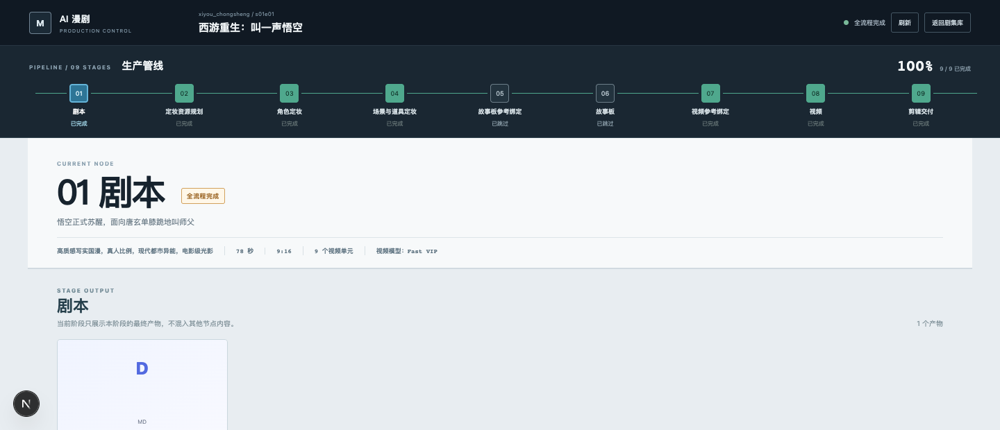
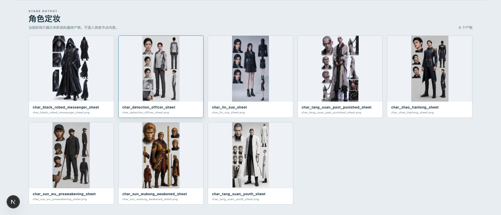

> **第一次使用？在仓库根目录打开 Codex，然后发送：`一键配置 AI漫剧-Codex 环境`**

# AI漫剧-Codex

Codex 驱动的 AI 漫剧/视频生产流：模型负责创作与调度，状态机负责版本、依赖和失败裁决，工作台负责查看资产与提交标注。

## 30 秒开始

```bash
git clone "https://github.com/Alraleya/AI--Codex.git"
cd "AI--Codex"
```

首次建议直接发送：

```text
一键配置 AI漫剧-Codex 环境
```

Codex 会自动安装依赖、运行测试和前端构建、确认仓库 Skill，并只读检查图片/视频 Provider；**不会触发任何媒体生成或付费调用**。

环境完成后，启动工作台：

```bash
python3 scripts/start_workbench.py --open
```

默认地址：`http://127.0.0.1:3000`。终端用户也可直接运行 `python3 scripts/bootstrap.py`；详细接入见 [首次接入指南](docs/INTEGRATION_GUIDE.md)。

## 核心组成

| 核心 | 位置 | 主要作用 |
|---|---|---|
| `manga-orchestrator` | `.agents/skills/manga-orchestrator/` | 用户唯一主入口；一键接入、推进、重做、处理标注、守住人工确认门 |
| Workflow 状态机 | `scripts/workflow.py`、`backend/workflow/` | 计算唯一合法下一步；校验 request、revision、schema、依赖和真实文件 |
| 阶段 Skills | `backend/skills/stages/` | 给对应生产阶段提供剧本、资产、定妆、剪辑等专业约束，由状态机自动注入 |
| 原生子 Agent | `.codex/agents/` | 生产结构化阶段结果或终审故事板；不能改状态、推进流程或调用 Provider |
| Provider 适配器 | `backend/runners/` | 接入真实图片/视频 CLI；失败时诚实阻塞，不用假资产降级 |
| Web 工作台 | `frontend/`、`backend/api.py` | 只读展示状态、Prompt、版本和媒体；唯一写操作是新增标注 |

## Video Workflow

主控循环：`status → advance / regenerate → next-action → 子 Agent → submit-agent-result`

| # | Stage | 核心产物 / 作用 |
|---:|---|---|
| 1 | `story_design` | 锁定剧本、分镜、生成单元、故事板 Prompt 和最终视频 Prompt |
| 2 | `asset_planning` | 规划角色/场景/道具及每个生成单元的引用 |
| 3 | `character_design` | 生成或复用角色定妆 |
| 4 | `visual_design` | 生成或复用场景与道具定妆 |
| 5 | `storyboard_binding` | 确定性生成故事板引用清单 |
| 6 | `storyboard_generation` | 生成故事板并支持指定镜头重做 |
| 7 | `video_binding` | 生成视频引用清单，锁定 Prompt SHA-256 |
| 8 | `video_generation` | 当前 revision 经人工确认后才生成视频 |
| 9 | `edit_post` | 根据真实视频生成剪辑与交付方案 |

第一阶段是内容权威；后续阶段只规划、生成和绑定资产，不能因故事板结果反向改写剧本或最终视频 Prompt。

## 核心 Skill 能力

| 能力 | `manga-orchestrator` 的动作 |
|---|---|
| 一键接入 | 执行 `scripts/bootstrap.py`，安装依赖、测试、构建并检查 Provider，不生成媒体 |
| 安全推进 | 每轮先读 `status`，只执行一个状态机允许的动作 |
| 子 Agent 调度 | 读取唯一 `next-action`，仅传 payload 与明确列出的附件 |
| 结果落盘 | 检查 JSON，再通过 `submit-agent-result` 交给状态机写入 |
| 增量标注 | 仅在 `pending_count > 0` 时读取新标注 |
| 精准重做 | 将 `redo` 绑定 Repair Plan，只替换指定 Task/镜头 |
| 人工闸门 | 资产复用与视频 revision 确认处停下等待用户决定 |
| 诚实失败 | 依赖、Provider 或产物无效时进入 `blocked`，不制造占位资产 |

内部阶段 Skill 与完整状态合同见 [Skill 与流程合同](docs/SKILLS_AND_WORKFLOW.md)。

## 工作台

| 工作台能做 | 工作台不能做 |
|---|---|
| 查看项目、剧集、九阶段和阻塞原因 | 创建剧集或推进 Workflow |
| 按生成单元查看 Prompt、绑定、定妆、故事板和视频 | 切换 Provider 或确认视频生成 |





截图仅展示界面；公开仓库不包含对应剧集、Prompt、参考图、视频或状态数据。

## 运行边界

| 边界 | 规则 |
|---|---|
| 状态 | `status.json` 是唯一业务状态源，只能由 Workflow 修改 |
| 图片 | 需已登录且支持图片生成的 Codex CLI，或兼容自定义 CLI |
| 视频 | 需兼容视频 CLI；每次生成都要确认当前 revision fingerprint |
| 数据 | `workspace/`、生成媒体、日志、环境变量默认不进入 Git |
| 失败 | Provider 或资产无效时进入 `blocked`，不使用 Mock/占位文件 |

更多文档：[首次接入](docs/INTEGRATION_GUIDE.md) · [Skill 与流程](docs/SKILLS_AND_WORKFLOW.md) · [技术架构](docs/WORKFLOW_AND_TECH_OVERVIEW.md) · [工作台说明](docs/USER_GUIDE.md) · [发布检查](docs/PUBLISHING_CHECKLIST.md)
