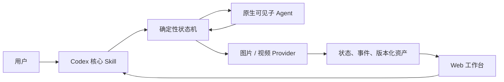
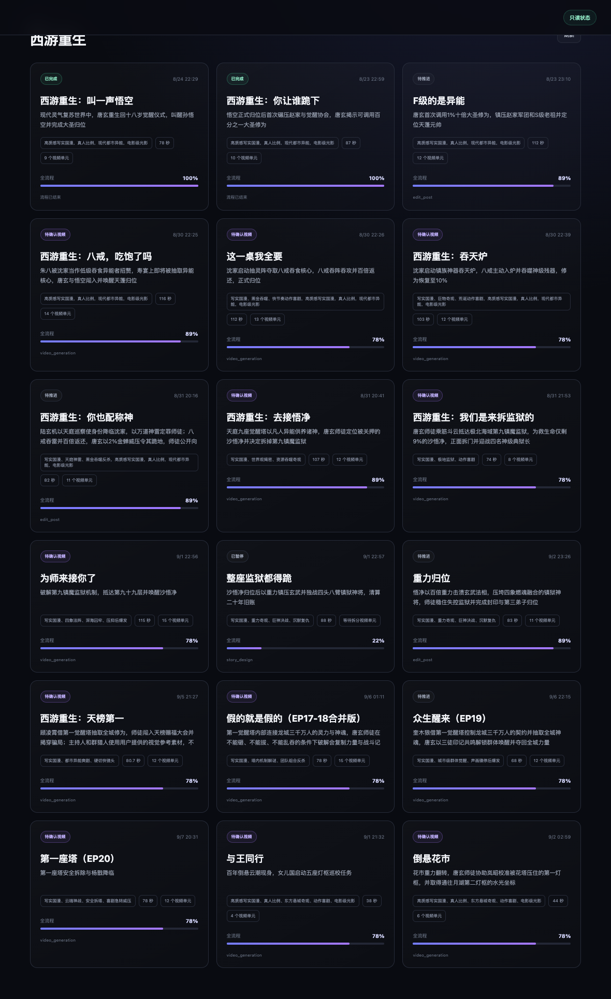

# AI漫剧-Codex

Codex 驱动的 AI 漫剧与视频制作工作流：Codex 负责理解、创作和调度，确定性状态机负责依赖、版本与失败裁决，Web 工作台负责展示资产和接收标注。

项目当前提供：

- 一个仓库级 Codex 核心 Skill：`.agents/skills/manga-orchestrator/`
- 两个受限原生子 Agent 角色：阶段生产与故事板终审
- 九阶段、可恢复的 Video Workflow
- 剧本、定妆、故事板、视频 Prompt 和成片的版本化资产合同
- 原生可见子 Agent 的 JSON 交接协议
- 只读为主的 Next.js 工作台，以及阶段/资产级标注
- 图片与视频 Provider 的可替换 CLI 适配层

> 当前实现偏向 AI 漫剧/短视频生产，不是通用视频剪辑器。剧集、图片、视频、日志和本机配置默认不会进入 Git。

## Video Workflow 是什么

这套 Workflow 把“会创作的模型”和“能裁决流程的程序”拆开：



- Codex 理解“继续制作、重做某镜、处理标注”等自然语言意图。
- 状态机决定唯一合法的下一步，验证 request、revision、文件名、JSON schema、真实字节和依赖。
- 子 Agent 只返回内容，不能直接改业务状态。
- Provider 只在授权边界内生成真实图片或视频。
- 工作台展示同一份状态与资产，不维护第二套流程状态。

主控循环保持很短：

```text
status → advance / regenerate → next-action → 子 Agent → submit-agent-result
```

## 核心 Skill 与主要能力

核心 Skill 位于 [`.agents/skills/manga-orchestrator/SKILL.md`](.agents/skills/manga-orchestrator/SKILL.md)。它是用户日常唯一需要显式调用的入口。

它主要负责：

1. 首次接入检查：验证依赖、测试、Skill 发现与 Provider 可用性，不误触发生成；
2. 剧集推进：先读 `status`，再执行一次合法的 `advance`；
3. 原生子 Agent 调度：读取唯一 `next-action`，只传 payload 与列出的附件；
4. 结果回传：检查 JSON 后用 `submit-agent-result` 交给状态机落盘；
5. 增量标注：只有 `pending_count > 0` 时才读取未处理标注；
6. 精准重做：把 redo 绑定 Repair Plan，只替换指定 Task/镜头；
7. 人工闸门：在资产复用、模型选择和视频 revision 确认处停下；
8. 诚实失败：依赖、Provider 或产物无效时进入 `blocked`，不制造假资产。

阶段内部还有 `design-episode`、`plan-visual-assets`、`design-characters`、`design-visual-assets`、`plan-edit` 等生产 Skill。它们由状态机按阶段注入子 Agent，不需要用户单独安装或逐个调用。完整分层见 [Skill 与流程合同](docs/SKILLS_AND_WORKFLOW.md)。

两个子 Agent 角色定义在 `.codex/agents/`：`manga-stage-producer` 只生成一个受 schema 约束的阶段结果，`manga-storyboard-reviewer` 只做故事板视觉终审。两者都不能推进状态、修改文件或调用 Provider。

## 九阶段生产流程

| # | Stage | 产物或职责 |
|---:|---|---|
| 1 | `story_design` | 锁定剧本、分镜、视频生成单元、故事板 Prompt 和最终视频 Prompt |
| 2 | `asset_planning` | 规划角色、场景、道具及逐单元引用 |
| 3 | `character_design` | 生成或复用角色定妆 |
| 4 | `visual_design` | 生成或复用场景与道具定妆 |
| 5 | `storyboard_binding` | 确定性生成故事板引用清单 |
| 6 | `storyboard_generation` | 按锁定 Prompt 生成故事板，可逐镜重做 |
| 7 | `video_binding` | 生成视频引用清单并锁定 Prompt SHA-256 |
| 8 | `video_generation` | 经当前 revision 人工确认后生成视频 |
| 9 | `edit_post` | 基于真实视频生成剪辑与交付方案 |

第一阶段是唯一内容权威：剧情、台词、动作、时长、分镜和最终视频 Prompt 在这里一次锁定。后续阶段只能规划、生成或绑定资产，故事板问题不能反向改写第一阶段 Prompt。

## 刚接入时要做什么

### 1. 安装并验证基础环境

需要 Python 3.9+、Node.js 20+、npm。建议同时安装 `ffprobe`，用于更严格的视频文件校验。

```bash
git clone "https://github.com/Alraleya/AI--Codex.git"
cd "AI--Codex"

python3 -m unittest discover -s backend/tests -v
cd frontend
npm install
npm run build
cd ..
```

这些命令只安装依赖并运行本地测试，不会调用图片或视频生成服务。

### 2. 从仓库根目录打开 Codex

Codex 会从 `.agents/skills` 发现核心 Skill。首次可以显式输入：

```text
$manga-orchestrator 帮我检查这套视频流程是否已经可以开始制作。
```

如果 Skill 没有立即出现，重启当前 Codex 会话。仓库级 Skill 的发现方式见 [OpenAI 官方说明](https://developers.openai.com/codex/skills)。

### 3. 选择接入深度

- **只体验状态机与工作台**：不配置 Provider；可以创建项目、查看状态、运行测试和浏览工作台，流程在真实生成步骤诚实阻塞。
- **接通真实图片**：默认使用已登录并支持图片生成的 Codex CLI；也可以配置兼容图片 CLI。
- **接通真实视频**：需要配置兼容视频 CLI；视频调用始终要求当前 Codex 对话对当前 revision fingerprint 单独确认。

Provider 的环境变量、命令模板和验收方式见 [首次接入指南](docs/INTEGRATION_GUIDE.md)。

### 4. 创建第一个试制剧集

先用一个 4–15 秒的小样验证闭环：

```bash
python3 scripts/workflow.py --workspace workspace create-project \
  --project demo --name "Demo"

python3 scripts/workflow.py --workspace workspace create-episode \
  --project demo --episode ep01 --name "First Shot" \
  --topic "雨夜屋檐下，两位旧友重逢" \
  --hook "一句称呼揭示两人的真实关系" \
  --duration 8 --style "写实电影感" --aspect-ratio 16:9 \
  --production-mode dialogue_direct --video-model fast

python3 scripts/workflow.py --workspace workspace status \
  --project demo --episode ep01
```

然后回到 Codex 说：

```text
$manga-orchestrator 继续制作 demo 的 ep01；每次到付费 Provider 或视频确认门时先停下来说明。
```

首次完整制作会依次遇到文字节点交接、资产复用确认、真实定妆生成、视频参考绑定、视频人工确认、视频生成和剪辑交付。状态机只允许合法的下一步。

## 工作台是做什么的

工作台是生产状态和资产的可视化投影，不是另一个调度器。它用于：

- 按项目查看所有剧集及整体进度；
- 查看九阶段状态、当前 Task、阻塞原因和最近事件；
- 按视频生成单元集中浏览锁定 Prompt、参考绑定、定妆图、故事板和视频；
- 查看资产 revision 与不可变旧版本；
- 添加阶段级或资产级 `suggestion` / `redo` 标注；
- 查看子 Agent 耗时、Provider 调用和 token 估算。

工作台不创建剧集、不推进流程、不切换 Provider，也不确认视频。除新增标注外，它只读。

### 启动工作台

首次安装前端依赖：

```bash
cd frontend
npm install
cd ..
```

启动后端和前端：

```bash
python3 scripts/start_workbench.py --open
```

默认打开 `http://127.0.0.1:3000`。如需指定数据目录或端口：

```bash
python3 scripts/start_workbench.py \
  --workspace /absolute/path/to/workspace \
  --api-port 8765 --web-port 3000 --open
```

首页左侧选择项目，右侧选择剧集；进入剧集页后，可切换九阶段或视频生成单元查看资产。页面中的选择只改变展示，不会推进生产。

### 《西游重生》工作台示例




截图使用本地《西游重生》数据展示界面能力；公开仓库只保留截图，不上传对应 `workspace/` 剧集、Prompt、参考图、视频、状态或 session 数据。

## 目录

```text
.agents/skills/manga-orchestrator/  Codex 仓库级核心 Skill
.codex/agents/                     受限的生产与视觉审查子 Agent 角色
backend/core/                       状态、事件、锁、资产与标注合同
backend/workflow/                   阶段编排、上下文和结果校验
backend/skills/stages/              注入各阶段子 Agent 的生产 Skill
backend/runners/                    图片与视频 Provider 适配器
backend/tests/                      状态机和资产合同测试
frontend/                           只读为主的工作台
scripts/workflow.py                 唯一流程 CLI
scripts/start_workbench.py          本地工作台启动器
workspace/                          本地运行数据；Git 默认忽略
```

## 文档

- [首次接入指南](docs/INTEGRATION_GUIDE.md)：克隆后逐步做什么、Provider 怎么接、如何验收
- [Skill 与流程合同](docs/SKILLS_AND_WORKFLOW.md)：核心 Skill、阶段 Skill、状态机和子 Agent 边界
- [流程与技术架构](docs/WORKFLOW_AND_TECH_OVERVIEW.md)：设计原理与数据模型
- [当前视频工作流](docs/CURRENT_VIDEO_WORKFLOW_ARCHITECTURE.md)：Prompt 与资产权威关系
- [工作台使用说明](docs/USER_GUIDE.md)：查看、标注与局部重做
- [发布到 GitHub 前检查](docs/PUBLISHING_CHECKLIST.md)：隐私、忽略规则、许可证和发布命令

## 测试

```bash
python3 -m unittest discover -s backend/tests -v
cd frontend && npm run build
```

所有自动测试都应使用临时目录，不向正式 `workspace/` 写入测试剧集。

## 当前边界

- 单机、本地文件系统优先。
- 不包含账号、权限、云同步或多人协作。
- 不用 Mock、占位图、文本文件或复制旧图冒充真实资产。
- Provider 失败时进入 `blocked`，不会静默降级。
- 发布前需要由仓库所有者选择并添加开源许可证；当前目录不替所有者做法律选择。
