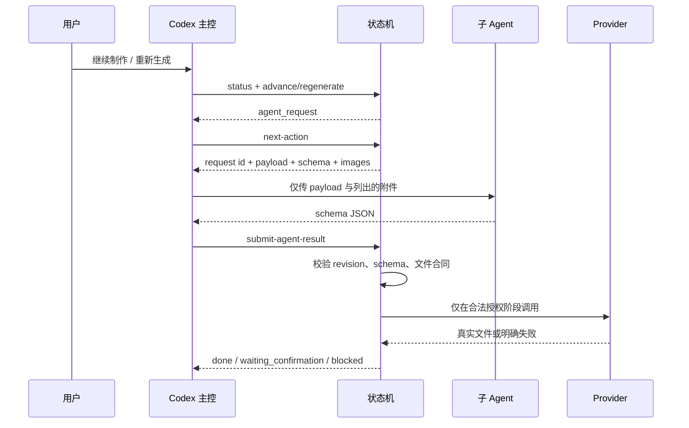

# Skill 与流程合同

## 两层 Skill

用户需要一个稳定入口推进剧集，每个生产阶段又需要严格的内容与资产合同，因此仓库使用“核心主控 Skill + 内部阶段 Skill”。

### 核心主控 Skill

位置：`.agents/skills/manga-orchestrator/SKILL.md`

它负责首次接入检查、读取状态、增量标注、推进或精准重做、调度可见子 Agent、回传 schema JSON，并在确认、阻塞、暂停或完成边界停下。

它不能直接编辑 `status.json`、在主会话重写子节点产物、跳过依赖、伪造成功，或在没有当前 revision 确认时调用视频 Provider。

主控使用两个仓库级子 Agent 角色：

| 角色 | 文件 | 职责 |
|---|---|---|
| `manga-stage-producer` | `.codex/agents/manga-stage-producer.toml` | 生成一个受限阶段的 schema JSON，并完成字段与内容自检 |
| `manga-storyboard-reviewer` | `.codex/agents/manga-storyboard-reviewer.toml` | 只读视觉审查故事板，定位阻塞镜头和修复指令 |

角色 TOML 定义能力边界；阶段 Skill 定义生产内容合同，两者不能互相替代。

### 内部阶段 Skill

位置：`backend/skills/stages/*/SKILL.md`

这些 Skill 由 `backend/workflow/context.py` 注入对应子 Agent，不是用户菜单入口。

| Stage | 注入 Skill | 核心限制 |
|---|---|---|
| `story_design` | `design-episode` | 唯一内容权威；一次锁定剧本、分镜和最终 Prompt |
| `asset_planning` | `plan-visual-assets` | 只规划资产，不写定妆 Prompt，不出图 |
| `character_design` | `design-characters` | 只处理计划内角色，执行已确认复用决策 |
| `visual_design` | `design-visual-assets` | 只处理计划内场景/道具，不改变内容 |
| `storyboard_binding` | 无模型 Skill | 状态机确定性生成引用清单 |
| `storyboard_generation` | Provider 执行 | 按锁定 Prompt 和引用清单出图 |
| `video_binding` | 无模型 Skill | 状态机生成引用清单和 Prompt SHA-256 |
| `video_generation` | Provider 执行 | 按确认过的 fingerprint 生成 |
| `edit_post` | `plan-edit` | 只基于真实视频生成剪辑交付方案 |

故事板全组完成后会产生 `storyboard_sequence_review` barrier request。审查子 Agent 只定位问题镜头和修复要求，不能重写第一阶段内容。

## 运行时交接



`status.json` 只保存一个 revision 绑定的 `agent_request`，防止多个模型节点同时拥有推进权。子 Agent 返回 `{files, review, summary, shot_plan, storyboard_plan}`，状态机负责路径保护、SHA-256、真实字节、版本登记和原子落盘。

## 内容与资产权威

| 内容 | 唯一权威 |
|---|---|
| 剧情、台词、动作、镜头、时长、转场 | 第一阶段 `script.md` / `storyboard.md` |
| 视频 Provider 正文 | 第一阶段 `shotNN_prompt_video.txt` |
| 故事板执行正文 | 第一阶段 `shotNN_prompt_storyboard.txt` |
| 资产数量、必要性、逐单元计划 | 第二阶段 `asset_plan.json` |
| 角色外观 | 角色定妆图 |
| 场景与道具外观 | 场景/道具定妆图 |
| 实际上传路径 | `shotNN_*_references.json` |

后续阶段只能执行或绑定这些权威内容。故事板出错不能反向修改第一阶段视频 Prompt。

## 状态与局部重做

`status.json` 是唯一业务状态来源；JSONL 只做审计，工作台只做投影。

- `suggestion`：修改完成或明确无需修改后，才能推进 handled cursor；
- `redo`：必须绑定 Repair Plan，经过 `planned → processing → verifying → resolved`；
- 局部故事板错误只重做明确镜头；
- 未选镜头和旧版本保持不变；
- 新资产通过真实文件和审查后才成为 active revision。

## 替换 Provider 时必须保留

1. 未授权调用必须拒绝；
2. 必需资产失败必须进入 `blocked`；
3. 可选资产可省略，但不能生成占位图；
4. 图片和视频必须通过真实字节/MIME 校验；
5. 视频确认绑定当前 Prompt、引用资产、模型、session 和 revision fingerprint；
6. 上游变化后旧确认必须失效；
7. Provider 返回成功但没有有效本地文件仍算失败。

## 常用命令图

```text
创建：create-project → create-episode
推进：status → advance → next-action → submit-agent-result
复用：confirm-asset-reuse
修复：annotations → plan-repair → regenerate → handle-annotations
视频：set-video-model / set-video-session → confirm-video
观察：start_workbench.py
```

完整参数以 `python3 scripts/workflow.py --help` 为准。首次配置见 [首次接入指南](INTEGRATION_GUIDE.md)。
