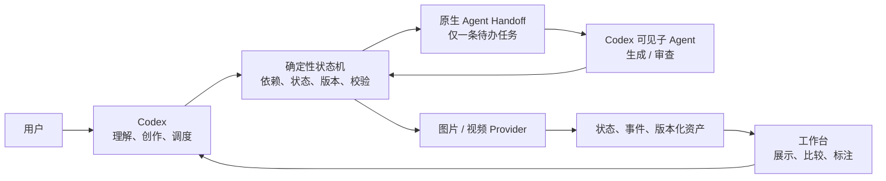
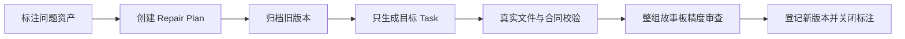

# Codex 驱动的 AI 漫剧生产系统

> 对外流程与技术方案摘要 · 2026-08-08

## 一句话定义

这是一套 **Codex 负责创作与调度、状态机负责确定性执行、工作台负责展示与反馈** 的 AI 漫剧生产系统。

它解决的不是“如何生成一张图”，而是如何让剧本、角色、场景、道具、故事板、视频 Prompt 和成片在多轮制作与修改后仍然可控、可追踪、可恢复。

## 核心架构



系统刻意把“智能判断”和“业务裁决”分开：模型可以创作和提出判断，但不能直接修改状态、跳过依赖或宣布一个无效产物成功。

## 四个核心设计

### 1. Codex 是唯一调度入口

用户通过自然语言创建、继续、诊断或重做剧集。生产动作不再散落在工作台按钮中，因此只有一个上下文中心和一个调度入口。

### 2. 状态机拥有最终裁决权

流程代码决定下一阶段、检查依赖、验证产物、登记版本并处理失败。`status.json` 是唯一业务状态来源，事件日志只负责审计，不参与状态判断。

### 3. 工作台是状态投影

工作台按“项目 → 剧集 → Stage → Task → Asset Revision”展示全流程，支持预览、版本比较和标注。除新增标注外，它不创建内容、不推进流程，也不确认视频。

### 4. 修改以资产为单位，而不是默认重跑阶段

一张故事板有问题时，系统定位到具体镜头 Task，只替换该资产。旧版本不可变归档，未选中的图片原样保留，下游只按真实依赖失效。

## 生产流程

完整九阶段被组织成四个生产区：

| 生产区 | 阶段 | 目标 |
|---|---|---|
| 内容锁定 | 1. 剧本与分镜定稿 | 一次性锁定剧本、内部镜头、视频生成单元、故事板 Prompt 和最终视频 Prompt |

如果创建剧集时传入完整剧本与分镜，第一阶段会把它作为不可变源文本：`script.md` 必须与用户输入逐字一致，系统只按视频 Provider 的生成单元机械拆分。一个生成单元可以包含多个内部短镜头；流程不做语义审查、扩写、重排或时长再分配。

新剧集默认把 `storyboard_decision` 记录为 `no`，不生成故事板。此时只跳过故事板参考绑定和故事板生成；第一阶段锁定视频 Prompt、资源规划、定妆和视频参考绑定仍照常执行。需要故事板时，创建剧集时显式选择 `yes`/`storyboard`。
| 资产规划与定妆 | 2. 定妆资源规划；3. 角色定妆；4. 场景与道具定妆 | 锁定资产数量、必要性和跨单元视觉基准 |
| 故事板执行与绑定 | 5. 故事板参考绑定；6. 故事板出图；7. 视频参考绑定 | 只生产资产和绑定路径，不修改内容或 Prompt |
| 成片交付 | 8. 视频生成；9. 剪辑交付 | 生成真实视频并完成声音、字幕和剪辑方案 |

视频生成单元数量由第一阶段决定；当前单元为4–15秒，内部可以包含多个更短的剪辑镜头。故事板网格和时间点也在第一阶段锁定。故事板采用灰度导演草稿，负责执行既定构图和动作状态；角色、场景、道具定妆图负责视觉外观。第二阶段的 `asset_plan.json` 决定每个参考资产是否必需以及绑定到哪些单元。必需资产失败会阻塞，可选资产失败直接省略，不生成占位图。

视频参考最多8张。第七阶段只生成参考路径 JSON 和第一阶段 Prompt 的 SHA-256；视频 Provider 原样提交第一阶段正文，不根据故事板重新改写。

流程只会停在四种结果：阶段完成、等待可见子 Agent、真实失败进入 `blocked`、到达视频人工确认门。

## 主控与子节点边界

主控 Codex 是流程控制器，不是所有节点的长期工作记忆：

```text
主控：status → next-action → 委派 → submit-agent-result
子节点：只读 payload 和附件 → 返回 schema JSON
状态机：校验 → 落盘 → 推进或 blocked
```

每个大节点只启动一个短生命周期子节点。状态机保存完整产物和一条不超过 1200 字的 `handoff`；下一大节点启动新的子节点，只读取必要原文、图片和上游 handoff。子节点结束后不再把它的上下文传给后续节点；旧对话只用于审计，不作为工作输入。

## 原生 Agent 调度协议

后端不启动 `codex exec` 来生成文字或在后台审查。它只把唯一待办写入 `status.json`：

```text
advance / regenerate
  → stage_generation
  → storyboard_sequence_review（Barrier）
```

Codex 主会话读取 `next-action` 后，显式委派可见子 Agent；子 Agent 只返回受 schema 约束的 JSON。主会话通过 `submit-agent-result` 回传，状态机校验 request id、阶段 revision、文件合同和资产真实性后才转移状态。子 Agent 不能写 `status.json`、推进流程或静默调用付费 Provider，也不能依赖主会话里未出现在 payload 的历史。

流程还提供 confirmation-gated 的 `rollback`：未明确选择时只返回“保留指定阶段”或“全部重做”的确认问题；确认后才改变阶段状态。每次可见子 Agent 的启动和回传都会写入一条固定、短格式的 progress 事件，不复制完整上下文，供工作台展示而不增加模型输入。

## 局部重做闭环



Repair Plan 固化目标 Stage、Task、基础资产版本、标注 ID、annotation watermark、修复要求和下游影响，防止执行过程中范围漂移。

每张新故事板先通过真实文件、镜头网格、资产合同和逐镜参考清单校验；全部目标就绪后，只由一个跨镜头 Barrier Review 快速检查角色/道具身份、运动方向、空间轴线、动作承接和明显构图错误。审查还要确认灰度底图与定妆图职责没有混用、控制标记语义清楚且未过量。若未通过，结果只需定位到具体镜头并给出修复指令。

## 两类质量关口

| 关口 | 检查内容 |
|---|---|
| 确定性合同 | 文件名、数量、镜号、时长、网格、时间点、真实字节、MIME 和引用关系 |
| 节点自检 | 子 Agent 在同一轮只检查会阻断交付的硬错误；失败即阻塞 |
| 整组故事板检查 | 故事板全组就绪后，只执行一次精简 Barrier Review |

“Provider 返回成功”不等于“阶段完成”。只有产物通过三层关口，才能成为活跃资产。

## 数据与版本模型

```text
Episode → Stage → Task → Asset Revision → Annotation
                    └──── Repair Plan ────┘
```

- **Task** 是可独立执行和审查的最小生产单元，例如 `shot06`。
- **Asset Revision** 保留稳定逻辑 ID 和递增版本号，旧文件只读归档。
- **Annotation** 绑定具体 Stage、Task、资产及资产版本。
- **Repair Plan** 把重做标注变成可验证、可恢复的执行合同。

标注正文独立保存，`status.json` 只保留增量游标。只有 `pending_count > 0` 时，Codex 才读取未处理标注，从而减少重复上下文和 Token 消耗。

## 视频人工确认

文字和图片可由用户的“继续制作”或“重新生成”授权；视频必须单独确认。

确认绑定全部上游资产字节的 revision fingerprint。剧本、Prompt 或故事板只要发生变化，旧确认立即失效，避免用错误版本生成高成本视频。

## 技术实现

| 模块 | 当前实现 |
|---|---|
| 流程与本地服务 | Python 3.9+ |
| 前端工作台 | Next.js 16、React 19、TypeScript 5 |
| 状态与索引 | JSON |
| 事件审计 | JSONL |
| 资产存储 | 按项目和剧集隔离的本地文件系统 |
| 文字生成与自检 | Codex 原生可见子 Agent + JSON schema 回传 |
| 图片生成 | 图片 Provider；真实文件生成后先过合同校验，再进入一次整组视觉审查 |
| 视频生成 | 外部视频 CLI + 人工确认门 |

关键可靠性措施包括原子写入、剧集独占锁、逐项检查点、真实文件校验、路径保护、不可变版本、下游精确失效和诚实阻塞。系统禁止使用 Mock、占位图、复制旧图或假视频冒充成功。

## 产品边界

当前版本聚焦单机制作、流程展示、真实资产审阅、文本标注、局部重做和版本比较，不包含账号权限、云同步、多人协作、可视化流程编辑、画面涂鸦或人工版本合并。

> 核心原则始终不变：**Codex 负责理解与调度，状态机负责确定性裁决，工作台负责展示与反馈。**
